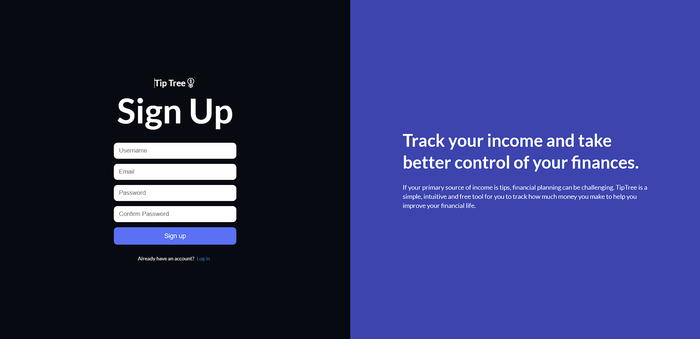
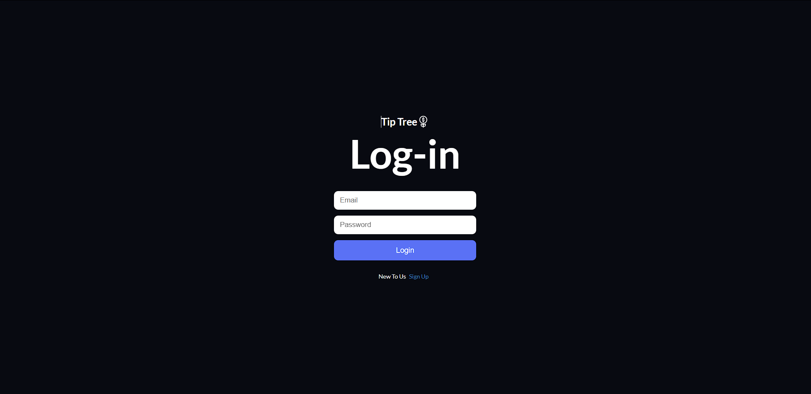
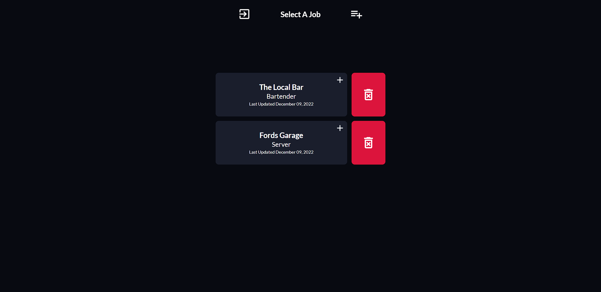
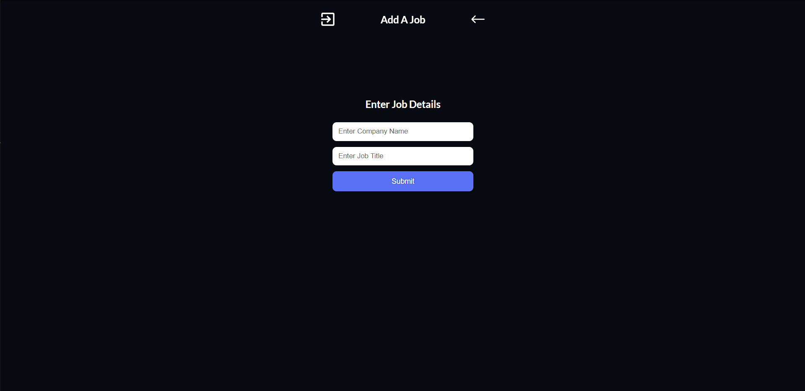
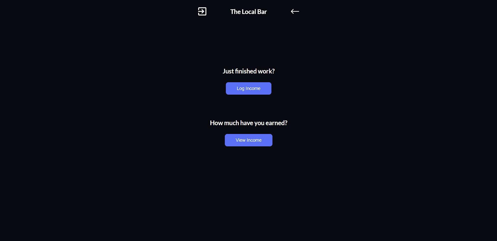
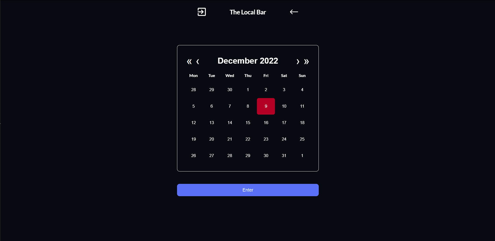
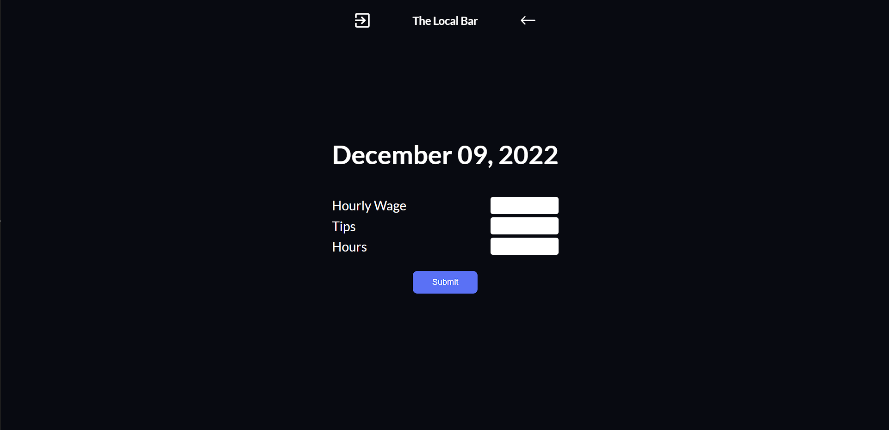
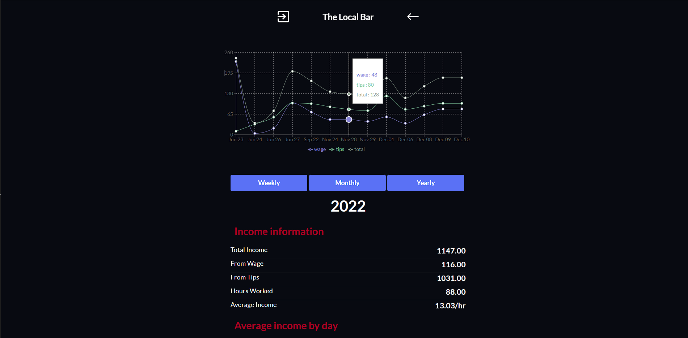
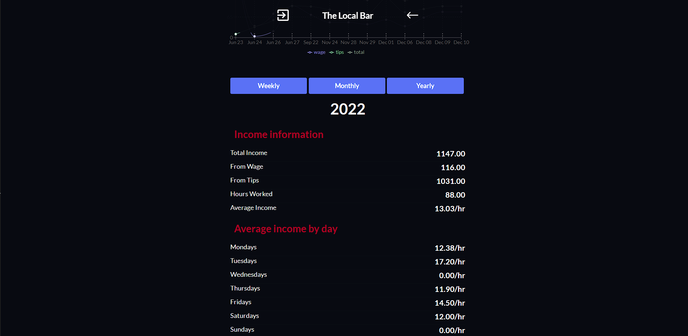

# TipTree

TipTree is a web application designed to help tip-based workers keep track of their income and be more finacially responsible. As someone who's worked in the hospitality industry for most of my life, i've used many tip tracking tools in the past and have been disappointed in most. With our application, we set out to improve user experience and deliver a quality app for free. Unlike other free tip tracking applications TipTree allows users to track their income across multiple jobs. 

### Signup & Login

In order to use TipTree, users will need to log in or sign up if they are a new user. Signing up requires a unique username and email not taken by another user, and a password. Once logged in, users will be brought to their home page where they can view their job/jobs. 

### Home Page

On the home page users will see all jobs that they have created. Located in the navigation bar they have two options either add a job or log out. Each job component displays the name of the job, the users job title, the date it was last updated, and an option to delete the job.

### Add a Job

When adding a job users are presented with two inputs that must be entered in order to create the new job these are Company Name and Job Title. After completing and submitting the form the user will be brought back to their home page.

### Job Page

After clicking on of the jobs located on the home page users are given the option to either log income or view your income.

### Log Income

When logging income a calender will appear allowing users to pick the date they wish to record. After choosing the date a form will appear asking users to enter their hourly wage, tips earned, and hours worked. Upon completion users are returned to their job page.

### View Income

When viewing income a graph will appear visualizing the users income with options to show data by the week, month, or year. Below the graph users can view a more detailed report of their earnings.

### Technologies Used

- MongoDB
- Express
- ReactJS
- Node.js
- SASS
- CanvasJS
- Heroku

### Getting Started
To get started simply click the link below and sign up. If you would like a quick way to explore the site there is a tester account the login information is below.

Email    - tester@mail.com
Password - tester

- [Deployed App](http://tiptree.herokuapp.com/)

### Future Features

- While TipTree is currently mobile friendly I hope to improve the mobile experience of the website.
- Get TipTree on the App store for iOS and Android.